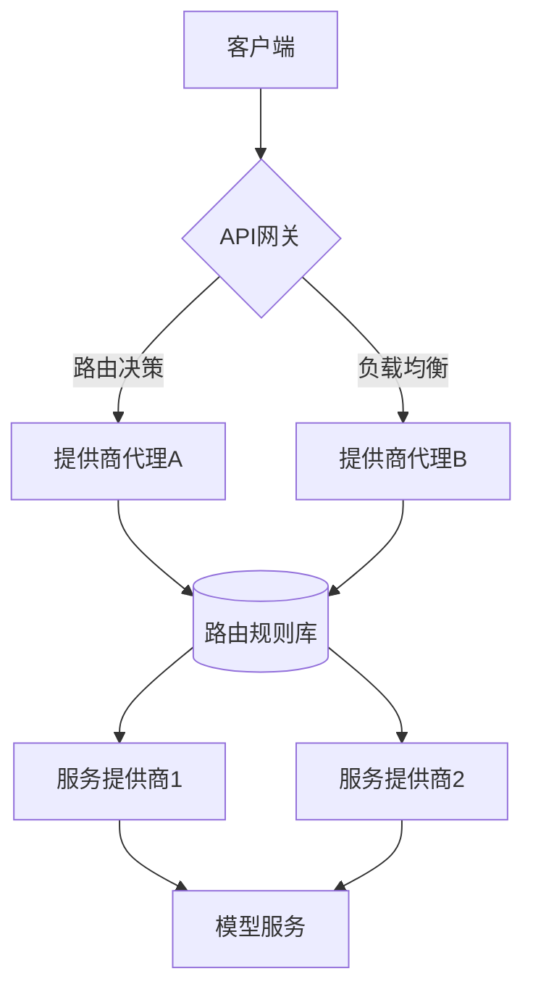

# NexusAI 聚合平台

## 🌟 核心功能
- **智能路由**：根据`model`参数自动选择最优服务提供商，支持模型别名映射（如"gpt-4"可映射到不同厂商的实际模型）
- **统一鉴权**：采用JWT令牌体系，支持多级密钥权限管理（管理员密钥/应用密钥/临时会话密钥）
- **协议兼容**：完整实现OpenAI API规范，支持同步/流式响应，兼容ChatGPT生态工具
- **多租户管理**：支持为不同团队创建隔离的密钥空间，实现用量配额和访问控制
- **实时洞察**：毫秒级监控指标采集，提供Token级成本核算和提供商健康状态分析

## 🛠️ 技术架构
### 系统拓扑


### 核心模块说明
**main.py**  
```python
# 请求处理管线
async def handle_chat_completions(request: Request):
    # 1. 请求解析 -> 2. 身份核验 -> 3. 模型解析 -> 4. 提供商选择
    # 5. 请求适配 -> 6. 流量控制 -> 7. 响应标准化
    # 全链路埋点追踪，支持跨提供商故障转移
```

**database.py**  
```sql
-- 服务商配置表
CREATE TABLE service_providers (
    id INTEGER PRIMARY KEY,
    name TEXT NOT NULL UNIQUE,  -- 厂商名称
    endpoint TEXT NOT NULL,     -- API端点
    api_key TEXT NOT NULL,      -- 加密存储的API密钥
    weight INTEGER DEFAULT 100, -- 流量权重
    rate_limit INT DEFAULT 60,  -- 每分钟请求上限
    is_active BOOLEAN DEFAULT 1 -- 启用状态
);

-- 模型路由表
CREATE TABLE model_routes (
    model_alias TEXT PRIMARY KEY,  -- 对外暴露的模型名称
    provider_id INTEGER NOT NULL,  -- 实际服务商ID  
    real_model_name TEXT NOT NULL, -- 厂商侧真实模型名
    cost_multiplier FLOAT DEFAULT 1.0 -- 成本系数
);
```

## 🚀 部署指南
### 环境配置
```bash
# 基于Python 3.10+环境
export NEXUS_SECRET_KEY="your-secure-signing-key"  # JWT签名密钥
export DB_ENCRYPTION_KEY="database-encryption-key" # 数据库加密密钥
export MONITORING_PORT=9321  # Prometheus指标暴露端口

# 安装依赖
pip install -r requirements.txt
```

### 服务管理
```bash
# 开发模式启动
python run.py --debug --port 8080

# 生产环境部署（使用Gunicorn+Uvicorn）
gunicorn -w 4 -k uvicorn.workers.UvicornWorker run:app \
  --bind 0.0.0.0:8080 --timeout 120
```

## 📡 API参考
### 请求示例
```bash
curl -X POST "http://localhost:8080/v1/chat/completions" \
  -H "Authorization: Bearer YOUR_API_KEY" \
  -H "Content-Type: application/json" \
  -d '{
    "model": "nexus-gpt4", 
    "messages": [{"role": "user", "content": "你好"}],
    "temperature": 0.7,
    "max_tokens": 500
  }'
```

### 响应结构
```json
{
  "id": "chatcmpl-3Qy4D5eJ5qg6Qb4v",
  "object": "chat.completion",
  "created": 1677652288,
  "model": "nexus-gpt4",
  "usage": {
    "prompt_tokens": 15,
    "completion_tokens": 112,
    "total_tokens": 127
  },
  "choices": [{
    "message": {
      "role": "assistant",
      "content": "您好！有什么我可以帮助您的？"
    },
    "finish_reason": "stop",
    "index": 0
  }]
}
```

## 🔧 管理控制台
### 提供商配置
```yaml
- name: "Azure OpenAI"
  endpoint: "https://{resource}.openai.azure.com"
  api_key: "******"
  models:
    - alias: "nexus-gpt4"      # 平台内模型名称
      real_name: "gpt-4"       # 厂商实际模型名
      rate_limit: 300          # 每分钟请求上限
      region_weights:          # 多区域负载配置
        eastus: 60
        westus: 40
```

### 监控指标
```prometheus
# HELP nexus_requests_total Total API requests
# TYPE nexus_requests_total counter
nexus_requests_total{provider="azure",model="gpt4",status="200"} 1423

# HELP nexus_latency_seconds API latency distribution
# TYPE nexus_latency_seconds histogram
nexus_latency_seconds_bucket{le="0.1"} 89
nexus_latency_seconds_bucket{le="0.5"} 1234
```

## 🔒 安全架构
- **密钥管理**：采用AES-256-GCM加密存储，密钥轮换策略每小时自动更新
- **请求验证**：HMAC签名机制，防止请求篡改
- **审计日志**：全量记录操作日志，保留180天
- **漏洞防护**：内置SQL注入/XXE攻击检测模块

## 📊 数据看板


- 实时流量热力图
- 提供商健康状态矩阵
- 成本分摊分析
- 异常请求检测

## 📌 版本路线图
- v1.3.0 (Q2 2024): 支持Anthropic/Bedrock等更多提供商
- v1.4.0 (Q3 2024): 添加自动故障转移和熔断机制
- v2.0.0 (Q4 2024): 实现分布式控制平面

## 📞 支持服务
```text
企业级支持:
- 7x24 紧急响应: +86 400-1234-5678
- 架构咨询: solutions@nexusai.com
- 漏洞报告: security@nexusai.com
```