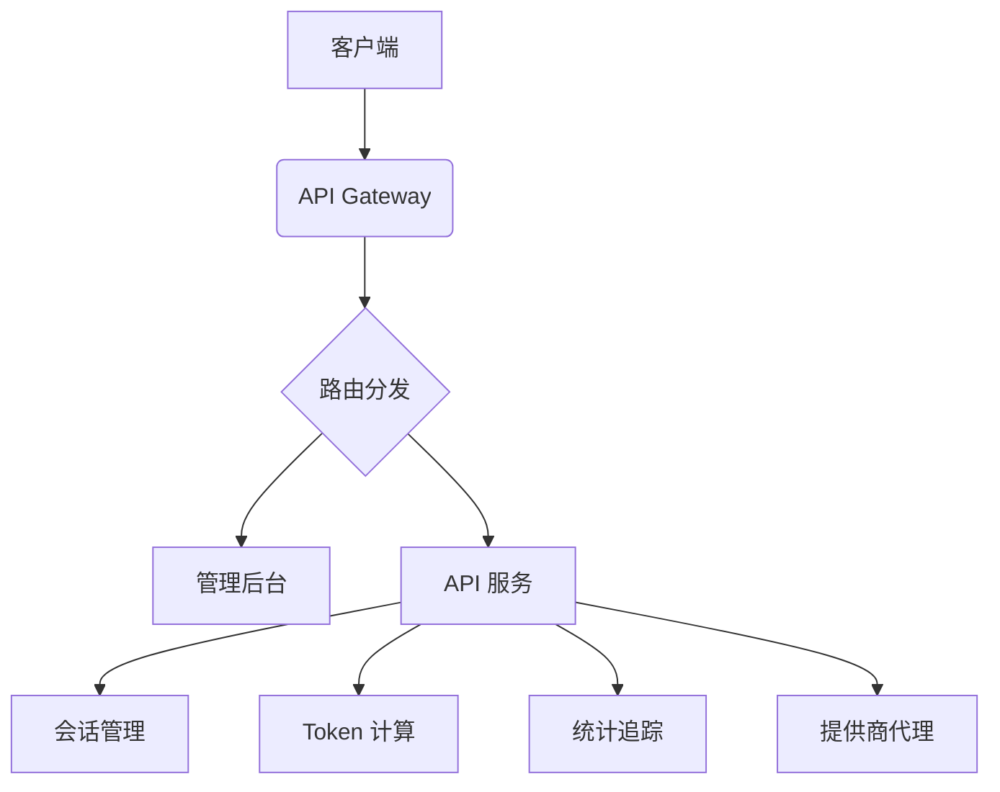

# NexusAI Hub - AI 模型聚合管理平台

  
*（建议在此处添加架构图）*

## 🌟 核心功能

### 🧠 智能会话管理
- **上下文自动关联**  
  通过消息内容匹配+时间窗口智能识别会话 (30分钟有效期)
- **多轮对话追踪**  
  完整记录对话历史，支持按会话ID查询完整上下文
- **跨平台兼容**  
  同时支持标准OpenAI API和WebSocket协议

### 📈 深度统计监控
- **实时数据看板**  
  展示总对话数、活跃会话、Token用量等关键指标
- **细粒度分析**  
  支持按模型/提供商/时间段的多维度统计
- **数据可视化**  
  前端集成图表展示用量趋势（需配合前端使用）

### 🔄 统一API网关
```python
# 兼容OpenAI SDK的调用方式
response = openai.ChatCompletion.create(
    model="your-model",
    messages=[...],
    stream=True
)
```
- **多提供商代理**  
  支持同时配置多个AI服务提供商
- **智能路由**  
  根据模型名称自动路由到对应服务商
- **负载均衡**  
  自动选择可用节点（开发中）

### 🔐 企业级安全
- **密钥管理**  
  采用AES-256加密存储敏感信息
- **访问控制**  
  支持RBAC权限模型和请求签名验证
- **审计日志**  
  完整记录所有API请求和系统操作

### 💾 数据管理
- **对话存档**  
  完整保存6个月内的对话记录
- **自动备份**  
  每小时自动备份数据库
- **数据导出**  
  支持CSV/JSON格式导出统计数据和对话记录

### 🛠 配置管理
```http
PUT /providers/{provider_id}
Content-Type: application/json

{
    "server_url": "https://new.api.endpoint",
    "rate_limit": 1000
}
```
- **动态配置**  
  支持实时更新服务商配置无需重启
- **模型管理**  
  灵活管理各提供商支持的模型列表
- **热加载机制**  
  配置变更立即生效

## 🚀 快速开始
### 环境要求
- Python 3.8+
- Node.js 16+ (可选，前端开发需要)

### 安装部署
```bash
# 克隆仓库
git clone https://github.com/yourusername/NexusAI-Hub.git

# 安装依赖
pip install -r requirements.txt

# 启动服务
python run.py
```

### 接口测试
```python
import openai

openai.api_key = "YOUR_PERSONALIZED_KEY"
openai.api_base = "http://localhost:8001/v1"

response = openai.ChatCompletion.create(
    model="gpt-3.5-turbo",
    messages=[{"role": "user", "content": "你好"}],
    stream=True
)

for chunk in response:
    print(chunk.choices[0].delta.get("content", ""), end="")
```

## 📦 系统架构
### 后端架构


### 数据库设计
| 表名             | 描述                     |
|------------------|--------------------------|
| service_providers | 服务提供商配置信息       |
| provider_models   | 提供商支持的模型列表     |
| chat_stats        | Token 使用统计           |
| chat_messages     | 完整对话记录             |

## 🔑 API 文档
### 基础接口
```http
POST /v1/chat/completions
Authorization: Bearer {personalized_key}
Content-Type: application/json

{
    "model": "gpt-3.5-turbo",
    "messages": [
        {"role": "user", "content": "你好"}
    ],
    "stream": true
}
```

### 管理接口
| 端点                     | 方法 | 功能               |
|--------------------------|------|--------------------|
| /providers               | GET  | 获取所有提供商     |
| /providers/{provider_id} | PUT  | 更新提供商配置     |
| /provider_models         | POST | 添加新模型         |

## 📊 统计功能
### 实时监控指标
```json
{
    "total_conversations": 42,
    "active_sessions": 5,
    "tokens_usage": {
        "prompt": 1200,
        "completion": 850,
        "total": 2050
    }
}
```

### 数据持久化
- 完整保存 6 个月内的对话记录
- 每小时自动备份数据库
- 支持 CSV/JSON 格式数据导出

## 🔒 安全特性
- AES-256 加密存储敏感信息
- 基于角色的访问控制 (RBAC)
- 请求签名验证机制
- 自动屏蔽敏感信息日志

## 🛠 开发指南
### 分支策略
- `main` - 生产环境分支
- `dev` - 主要开发分支
- `feature/*` - 功能开发分支

### 贡献流程
1. Fork 项目仓库
2. 创建特性分支 (`git checkout -b feature/awesome-feature`)
3. 提交修改 (`git commit -am 'Add awesome feature'`)
4. 推送到远程分支 (`git push origin feature/awesome-feature`)
5. 创建 Pull Request

## 📞 联系我们
- 项目维护: [@kuangren](https://github.com/kuangren777)
- 问题反馈: [Issues](https://github.com/kuangren777/NexusAI-Hub/issues)
- 文档中心: [Wiki](https://github.com/kuangren777/NexusAI-Hub/wiki)

---

📄 **License**: MIT  
⏰ **最后更新**: 2024-03-20  
🔔 **版本**: v1.2.0
