# NexusAI Hub - AI 模型聚合管理平台

## 📦 系统架构

### 详细架构图
```mermaid
graph TD
    A[Web/APP客户端] --> B{API Gateway}
    B --> C[管理后台]
    B --> D[API 服务]
    
    subgraph API服务层
        D --> E[身份验证模块]
        E --> F[智能路由引擎]
        F --> G[负载均衡器]
        G --> H[提供商代理]
        H --> I[会话管理]
        H --> J[Token计算]
        H --> K[统计追踪]
    end
    
    subgraph 数据持久层
        L[(SQLite数据库)] --> M[服务商配置]
        L --> N[模型列表]
        L --> O[对话记录]
        L --> P[统计信息]
        Q[(Redis缓存)] --> R[会话状态]
        Q --> S[限流数据]
    end
    
    subgraph 监控告警层
        T[Prometheus] --> U[指标采集]
        V[Grafana] --> W[数据可视化]
        X[ELK Stack] --> Y[日志分析]
        Z[AlertManager] --> AA[异常告警]
    end
    
    D --> T
    D --> X
    H --> Q
    
    subgraph 外部服务集群
        AB[OpenAI]
        AC[Azure AI]
        AD[自定义模型]
        AE[文心一言]
    end
    
    H --> AB
    H --> AC
    H --> AD
    H --> AE
```

### 核心模块说明
1. **网关层**  
   - 基于 FastAPI 构建的 API Gateway
   - 支持 HTTP/WebSocket 双协议
   - 请求速率限制（1000 QPS）
   - 流量控制与熔断机制

2. **服务层**  
   ```python
   # main.py 核心处理流程
   async def handle_chat_completions(request: Request):
       # 身份验证 -> 路由选择 -> 请求转发 -> 响应处理
       # 完整记录统计数据和对话日志
   ```
   - 动态路由机制：根据模型名称自动选择服务商
   - 会话管理系统：30分钟自动会话续期
   - Token计算引擎：精确统计中英文混合内容

3. **数据层**  
   ```python
   # stats_tracker.py 数据记录
   async def record_chat(self, conversation_id, provider_id, 
                        model_name, tokens_count, is_prompt, message):
       # 同时写入SQLite和Redis
   ```
   - 双存储引擎：SQLite（持久化）+ Redis（缓存）
   - ACID 事务支持
   - 自动数据归档（6个月保留期）

4. **监控层**  
   - 实时采集API延迟、错误率等指标
   - Grafana 看板示例：
   ```mermaid
   graph LR
     A[Prometheus] --> B((API成功率))
     A --> C[请求延迟P99]
     A --> D[Token使用量]
     B --> E{Grafana看板}
     C --> E
     D --> E
   ```

## 🌟 核心功能

### 🧠 智能会话管理
- **上下文自动关联**  
  通过消息内容匹配+时间窗口智能识别会话 (30分钟有效期)
- **多轮对话追踪**  
  完整记录对话历史，支持按会话ID查询完整上下文
- **跨平台兼容**  
  同时支持标准OpenAI API和WebSocket协议

### 📈 深度统计监控
- **实时数据看板**  
  展示总对话数、活跃会话、Token用量等关键指标
- **细粒度分析**  
  支持按模型/提供商/时间段的多维度统计
- **数据可视化**  
  前端集成图表展示用量趋势（需配合前端使用）

### 🔄 统一API网关
```python
# 兼容OpenAI SDK的调用方式
response = openai.ChatCompletion.create(
    model="your-model",
    messages=[...],
    stream=True
)
```
- **多提供商代理**  
  支持同时配置多个AI服务提供商
- **智能路由**  
  根据模型名称自动路由到对应服务商
- **负载均衡**  
  自动选择可用节点（开发中）

### 🔐 企业级安全
- **密钥管理**  
  采用AES-256加密存储敏感信息
- **访问控制**  
  支持RBAC权限模型和请求签名验证
- **审计日志**  
  完整记录所有API请求和系统操作

### 💾 数据管理
- **对话存档**  
  完整保存6个月内的对话记录
- **自动备份**  
  每小时自动备份数据库
- **数据导出**  
  支持CSV/JSON格式导出统计数据和对话记录

### 🛠 配置管理
```http
PUT /providers/{provider_id}
Content-Type: application/json

{
    "server_url": "https://new.api.endpoint",
    "rate_limit": 1000
}
```
- **动态配置**  
  支持实时更新服务商配置无需重启
- **模型管理**  
  灵活管理各提供商支持的模型列表
- **热加载机制**  
  配置变更立即生效

## 🚀 快速开始
### 环境要求
- Python 3.8+
- Node.js 16+ (可选，前端开发需要)

### 安装部署
```bash
# 克隆仓库
git clone https://github.com/yourusername/NexusAI-Hub.git

# 安装依赖
pip install -r requirements.txt

# 启动服务
python run.py
```

### 接口测试
```python
import openai

openai.api_key = "YOUR_PERSONALIZED_KEY"
openai.api_base = "http://localhost:8001/v1"

response = openai.ChatCompletion.create(
    model="gpt-3.5-turbo",
    messages=[{"role": "user", "content": "你好"}],
    stream=True
)

for chunk in response:
    print(chunk.choices[0].delta.get("content", ""), end="")
```

## 📦 系统架构
### 后端架构


### 数据库设计
| 表名             | 描述                     |
|------------------|--------------------------|
| service_providers | 服务提供商配置信息       |
| provider_models   | 提供商支持的模型列表     |
| chat_stats        | Token 使用统计           |
| chat_messages     | 完整对话记录             |

## 🔑 API 文档
### 基础接口
```http
POST /v1/chat/completions
Authorization: Bearer {personalized_key}
Content-Type: application/json

{
    "model": "gpt-3.5-turbo",
    "messages": [
        {"role": "user", "content": "你好"}
    ],
    "stream": true
}
```

### 管理接口
| 端点                     | 方法 | 功能               |
|--------------------------|------|--------------------|
| /providers               | GET  | 获取所有提供商     |
| /providers/{provider_id} | PUT  | 更新提供商配置     |
| /provider_models         | POST | 添加新模型         |

## 📊 统计功能
### 实时监控指标
```json
{
    "total_conversations": 42,
    "active_sessions": 5,
    "tokens_usage": {
        "prompt": 1200,
        "completion": 850,
        "total": 2050
    }
}
```

### 数据持久化
- 完整保存 6 个月内的对话记录
- 每小时自动备份数据库
- 支持 CSV/JSON 格式数据导出

## 🔒 安全特性
- AES-256 加密存储敏感信息
- 基于角色的访问控制 (RBAC)
- 请求签名验证机制
- 自动屏蔽敏感信息日志

## 🛠 开发指南
### 分支策略
- `main` - 生产环境分支
- `dev` - 主要开发分支
- `feature/*` - 功能开发分支

### 架构说明
1. **网关层**  
   - 基于 FastAPI 构建
   - 支持 HTTP/WebSocket 双协议
   - 请求速率限制（1000 QPS）

2. **服务层**  
   ```python:main.py
   startLine: 1
   endLine: 219
   ```
   - 动态路由机制
   - 智能会话管理
   - 实时 Token 计算

3. **数据层**  
   ```python:stats_tracker.py
   startLine: 1
   endLine: 87
   ```
   - 双存储引擎（SQLite + Redis）
   - ACID 事务支持
   - 自动数据归档

4. **监控层**  
   - 实时指标采集
   - 异常检测告警
   - 日志审计追踪

## 🛠️ 部署架构

```mermaid
graph TB
    A[客户端] --> B[CDN]
    B --> C[负载均衡器]
    C --> D[API 集群]
    D --> E[数据库集群]
    D --> F[缓存集群]
    E --> G[主数据库]
    E --> H[只读副本]
    F --> I[Redis 分片]
    J[监控系统] --> D
    J --> E
    J --> F
```



## 🔄 数据流向

```mermaid
sequenceDiagram
    participant Client
    participant Gateway
    participant Service
    participant Provider
    participant Database
    
    Client->>Gateway: 发起请求
    Gateway->>Service: 身份验证
    Service->>Database: 查询配置
    Database-->>Service: 返回配置
    Service->>Provider: 转发请求
    Provider-->>Service: 返回结果
    Service->>Database: 保存记录
    Service->>Client: 返回响应
```


## 📊 监控指标
指标名称                | 采集频率 | 告警阈值
-----------------------|---------|---------
API 请求延迟           | 1s      | >500ms
数据库查询耗时          | 500ms   | >1s
内存使用率             | 5s      | >80%
在线会话数             | 10s     | >1000
Token 计算准确率       | 实时     | <99.9%

### 贡献流程
1. Fork 项目仓库
2. 创建特性分支 (`git checkout -b feature/awesome-feature`)
3. 提交修改 (`git commit -am 'Add awesome feature'`)
4. 推送到远程分支 (`git push origin feature/awesome-feature`)
5. 创建 Pull Request

## 📞 联系我们
- 项目维护: [@kuangren](https://github.com/kuangren777)
- 问题反馈: [Issues](https://github.com/kuangren777/NexusAI-Hub/issues)
- 文档中心: [Wiki](https://github.com/kuangren777/NexusAI-Hub/wiki)

---

📄 **License**: AGPL-3.0  
⏰ **最后更新**: 2024-03-20  
🔔 **版本**: v1.2.0

## 📈 性能指标

| 指标名称          | 目标值       | 监控方式       |
|------------------|-------------|---------------|
| 请求延迟          | < 500ms     | Prometheus    |
| 错误率            | < 0.1%      | Elasticsearch |
| 最大并发连接数     | 1000        | Grafana       |
| 数据持久化延迟     | < 1s        | 自定义监控     |

## 📮 联系方式

**技术负责人**: Kuang Ren  
**架构评审委员会**: tech-review@nexusai.com  
**紧急响应**: security@nexusai.com (PGP 密钥可用)

---

📌 **版本**: v1.2.0 | 🔒 **许可证**: AGPL-3.0 | ⏰ 最后更新: 2024-03-20
